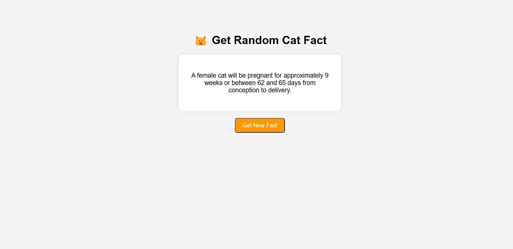

# 🐱 Cat Fact App

A simple Flask web app that displays random cat facts using a public API. Built with Python, Flask, and HTML/CSS.

---

## 🚀 Features

- Fetches real-time cat facts from the [Cat Fact API](https://catfact.ninja)
- Minimal Flask backend with dynamic front-end rendering
- Simple and responsive UI
- Great beginner-friendly project for learning API integration

---

## 🖥️ Screenshot



> 📸 *Screenshot of the app fetching a random cat fact*

---

## 📦 Tech Stack

- Python
- Flask
- HTML / CSS
- Cat Fact API

---

## 📄 Requirements

Install dependencies using:

```bash
pip install -r requirements.txt
